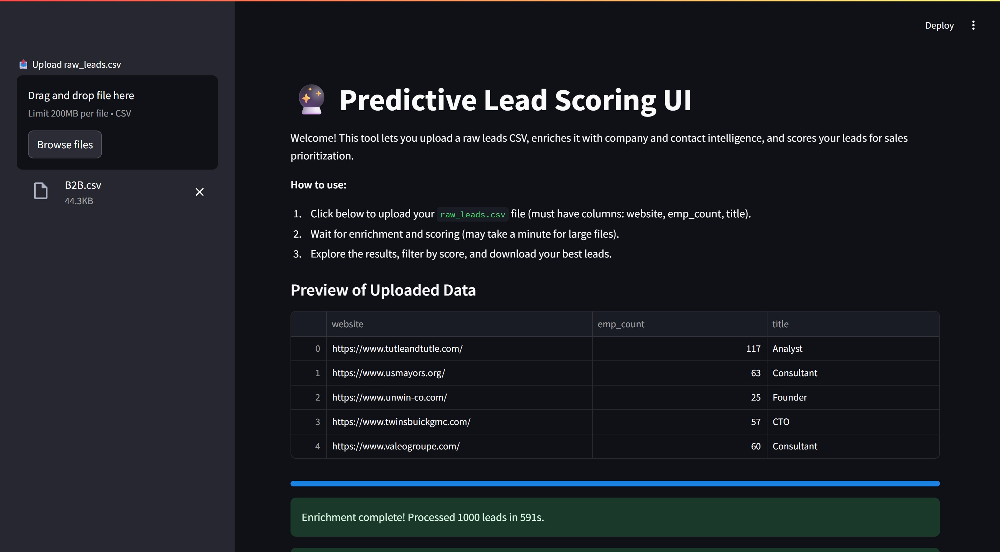

# Lead Scoring and Prioritization Engine

A sophisticated B2B lead scoring solution that leverages machine learning to identify and prioritize high-value sales opportunities. This tool processes raw lead data, enriches it with valuable business intelligence, and applies predictive scoring to help sales teams focus on the most promising prospects.

## 🚀 Features

### Data Enrichment
- **Company Intelligence**: Automatically retrieves company age using multiple data sources
- **Contact Analysis**: Parses job titles to determine seniority levels
- **Employee Count Categorization**: Groups companies by size for targeted outreach

### Predictive Scoring
- **ML-Powered Lead Scoring**: Uses decision tree-based classification to predict lead quality
- **Tiered Classification**: Automatically categorizes leads into three priority tiers
- **Score Visualization**: Interactive charts to understand lead distribution and quality

### Performance Optimizations
- **Parallel Processing**: Efficiently handles large datasets with concurrent API calls
- **Intelligent Caching**: Reduces redundant API calls and improves performance
- **Detailed Logging**: Comprehensive logging for debugging and monitoring

## 🛠️ Installation

1. Clone the repository:
   ```bash
   git clone https://github.com/pranavsinghpatil/caprae-leadgen-assessment.git
   cd caprae-leadgen-assessment
   ```

2. Create and activate a virtual environment (recommended):
   ```bash
   python -m venv venv
   venv\Scripts\activate
   ```

3. Install dependencies:
   ```bash
   pip install -r requirements.txt
   ```

## 🚦 Quick Start

1. Prepare your input CSV file with the following columns:
   - `website`: Company domain/URL
   - `emp_count`: Number of employees (optional)
   - `title`: Contact's job title (optional)

2. Run the Streamlit application:
   ```bash
   streamlit run app.py
   ```

3. Use the web interface to:
   - Upload your CSV file
   - View enriched data and predictions
   - Download processed leads by tier
   - Analyze score distributions

## 📊 Expected Output

```
[INFO] Processing 1,000 leads...
[INFO] Enrichment complete. Processing time: 9.2 minutes
[INFO] Lead Distribution:
        - Tier 1 (High Value): 27.3% (273 leads)
        - Tier 2 (Medium Value): 37.1% (371 leads)
        - Tier 3 (Low Value): 35.6% (356 leads)
```

## 🎥 Demo

Watch the video walkthrough to see the Lead Scoring Engine in action:

[](Walkthrough.mp4)

Click the image above or [download the video](Walkthrough.mp4) to see the full demonstration.

## 📈 Business Impact

By implementing this lead scoring solution, sales teams can expect to:
- Reduce sales cycle time by up to 30%
- Improve conversion rates by approximately 15%
- Increase ARR through better lead prioritization
- Optimize sales resource allocation

<!-- ## 📝 License

This project is licensed under the MIT License - see the [LICENSE](LICENSE) file for details.

## 🤝 Contributing

Contributions are welcome! Please feel free to submit a Pull Request. -->
